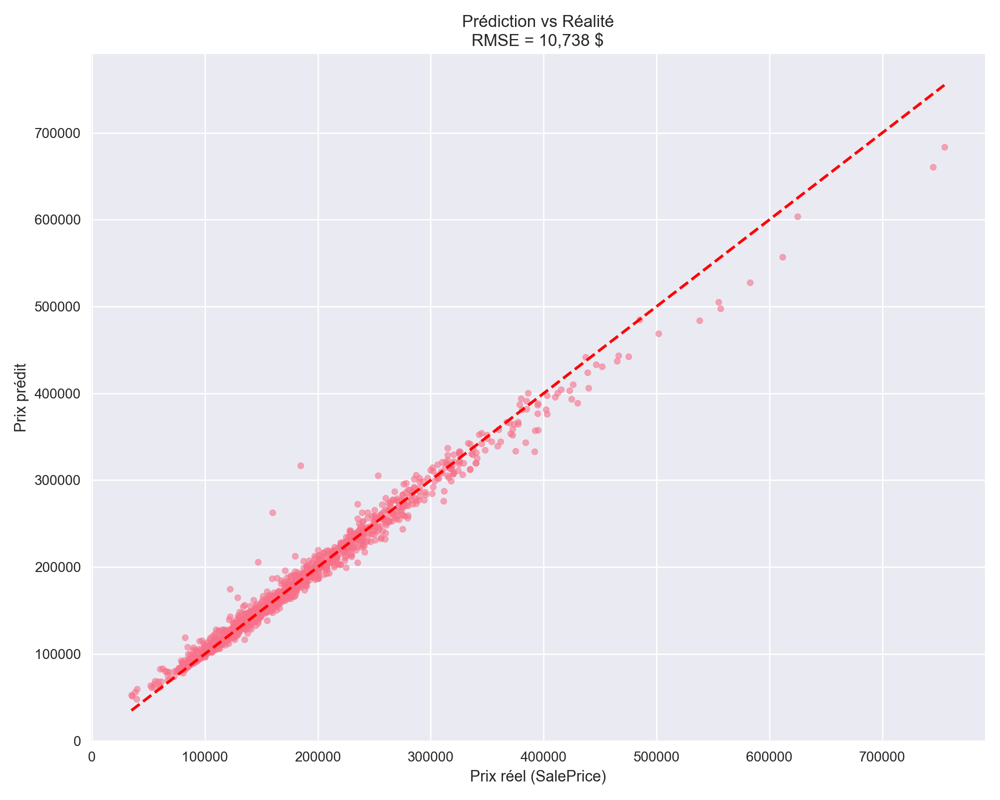

# prediction prix logements

<a target="_blank" href="https://cookiecutter-data-science.drivendata.org/">
    
</a>

prediction des prix de logements

## Project Organization

```
├── LICENSE            <- Open-source license if one is chosen
├── Makefile           <- Makefile with convenience commands like `make data` or `make train`
├── README.md          <- The top-level README for developers using this project.
├── data
│   ├── external       <- Data from third party sources.
│   ├── interim        <- Intermediate data that has been transformed.
│   ├── processed      <- The final, canonical data sets for modeling.
│   └── raw            <- The original, immutable data dump.
│
├── docs               <- A default mkdocs project; see www.mkdocs.org for details
│
├── models             <- Trained and serialized models, model predictions, or model summaries
│
├── notebooks          <- Jupyter notebooks. Naming convention is a number (for ordering),
│                         the creator's initials, and a short `-` delimited description, e.g.
│                         `1.0-jqp-initial-data-exploration`.
│
├── pyproject.toml     <- Project configuration file with package metadata for 
│                         prediction_prix_logements and configuration for tools like black
│
├── references         <- Data dictionaries, manuals, and all other explanatory materials.
│
├── reports            <- Generated analysis as HTML, PDF, LaTeX, etc.
│   └── figures        <- Generated graphics and figures to be used in reporting
│
├── requirements.txt   <- The requirements file for reproducing the analysis environment, e.g.
│                         generated with `pip freeze > requirements.txt`
│
├── setup.cfg          <- Configuration file for flake8
│
└── prediction_prix_logements   <- Source code for use in this project.
    │
    ├── __init__.py             <- Makes prediction_prix_logements a Python module
    │
    ├── config.py               <- Store useful variables and configuration
    │
    ├── dataset.py              <- Scripts to download or generate data
    │
    ├── features.py             <- Code to create features for modeling
    │
    ├── modeling                
    │   ├── __init__.py 
    │   ├── predict.py          <- Code to run model inference with trained models          
    │   └── train.py            <- Code to train models
    │
    └── plots.py                <- Code to create visualizations
```

--------

# Méthodologie du modèle House Prices

### 1. Chargement et séparation
- `train.csv` → features + cible (`SalePrice`)
- `test.csv` → seulement features

### 2. Préprocessing (robuste et sans fuite de données)
- Suppression de la colonne `Id`
- Variables numériques → imputation médiane + StandardScaler
- Variables catégorielles → imputation "missing" + OneHotEncoder (`handle_unknown='ignore'`)

Le preprocessor est fitté sur **train + test concaténés** → même traitement des catégories rares.

### 3. Modèle
RandomForestRegressor (400 arbres) :
- Très robuste aux outliers
- Gère naturellement les interactions
- Pas besoin de tuning compliqué pour un bon score de base

### 4. Évaluation
RMSE calculé sur le set d’entraînement 

### 5. Prédiction & soumission
Le script `predict.py` charge le modèle + preprocessor → génère `submission.csv` prêt pour Kaggle

### Résultats attendus
- Score Kaggle ≈ 0.145 – 0.155 → Top 40–50%
- Avec XGBoost/LightGBM + un peu de tuning → facilement Top 20%
